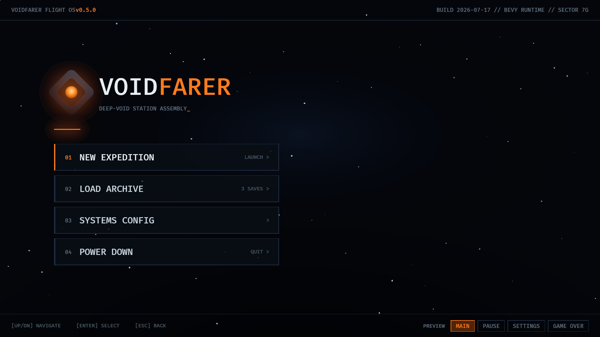
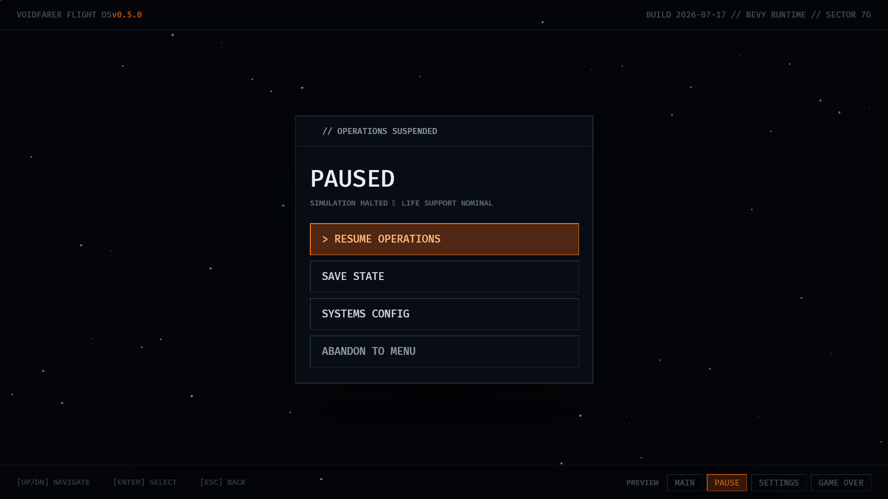
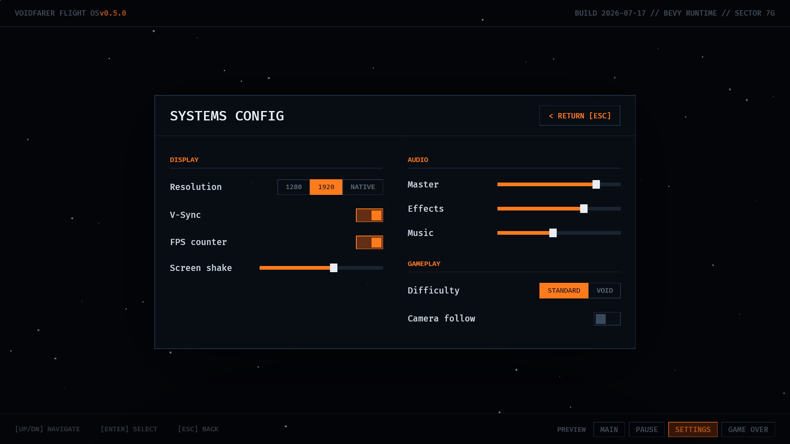
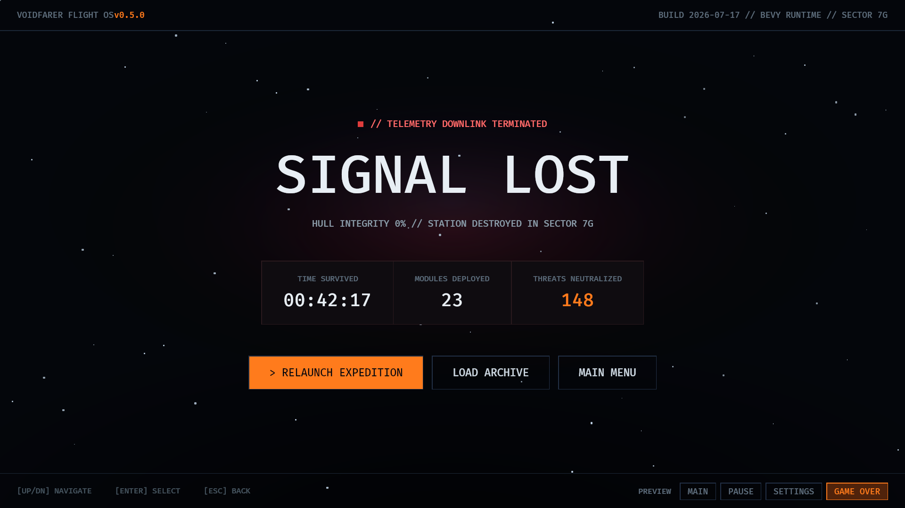

# game_menu — a sci-fi game menu in Supersolid

A "Flight OS" style game front-end (codename **VOIDFARER**), authored in
Solid-style `.tsx` and run by superui's supersolid runtime on top of `bevy_ui`.
It reproduces a sci-fi game-menu design as closely as `bevy_ui` + flair 0.6
allow.

|  |  |
| :---: | :---: |
|  |  |
| **Main menu** | **Pause** |
|  |  |
| **Systems config** | **Game over** |

## What it shows

Four screens plus persistent chrome:

- **Main menu** — emblem, `VOID`·`FARER` wordmark, blinking tagline cursor,
  and a numbered menu list (`NEW EXPEDITION` / `LOAD ARCHIVE` /
  `SYSTEMS CONFIG` / `POWER DOWN`).
- **Pause** — a translucent-scrim modal (`PAUSED`) with resume / save /
  config / abandon actions.
- **Systems config** — a two-column grid of live, interactive controls:
  segmented pickers (resolution, difficulty), toggle switches (V-Sync, FPS,
  camera) and sliders. The toggles/pickers are backed by signals, so flipping
  one updates only that widget.
- **Game over** — `SIGNAL LOST`, a run-stats row, and relaunch actions.

The bottom-right **PREVIEW** tab bar switches between the four screens. That tab
bar and the config controls are what exercise supersolid's fine-grained
reactivity — a `screen` signal drives four `<Show>` blocks, and each tab's
`active` highlight is a reactive class binding.

## Running

```sh
# Native, live .tsx with state-preserving hot reload (edit app.tsx and save):
cargo run -p game_menu --features hmr

# Native, loads the pre-transpiled app.generated.js (build.rs output); no HMR:
cargo run -p game_menu

# Web:
cargo build -p game_menu --target wasm32-unknown-unknown
```

`cargo run` sets the working directory to this crate so `assets/` resolves. An
optional `mcp_debug` feature (`--features mcp_debug`) registers
`bevy_brp_extras::BrpExtrasPlugin` for BRP inspection.
